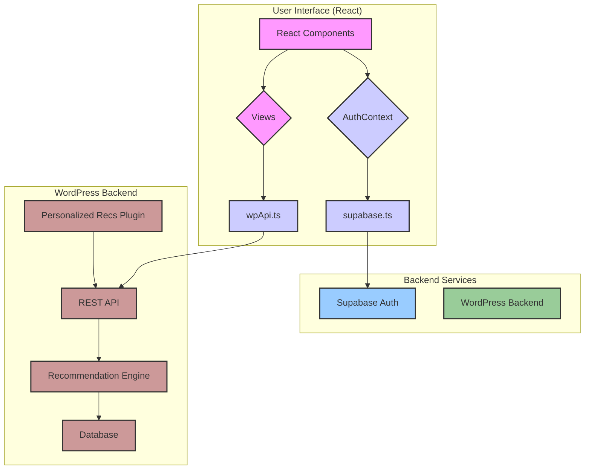

## Architecture Explanation

This project is a modern web application with a decoupled architecture, consisting of a React frontend, a Supabase backend for authentication, and a WordPress backend for content and recommendations.

### Processing Layers

1.  **Presentation Layer (React Frontend):** This is the user-facing part of the application, built with React and Vite.
    *   **React Components (`src/components`):** A collection of reusable UI components for various parts of the application like forms, layout, and resource display.
    *   **Views (`src/views`):** These components represent the different pages of the application, such as the Home page, Recommendations, and Profile.
    *   **AuthContext (`src/contexts/AuthContext.tsx`):** Manages user authentication state and provides authentication methods (login, signup, signout) to the rest of the application.
    *   **wpApi.ts (`src/lib/wpApi.ts`):** A module responsible for making API calls to the WordPress backend to fetch recommendations and other data.
    *   **supabase.ts (`src/lib/supabase.ts`):** This module initializes the Supabase client and is used by the `AuthContext` to interact with Supabase for authentication.

2.  **Application Layer (Backend Services):** This layer handles the business logic and data processing.
    *   **Supabase Auth:** Provides user authentication and management services. The React frontend communicates directly with Supabase for user sign-up, sign-in, and session management.
    *   **WordPress Backend:** A WordPress installation with a custom plugin that provides the core recommendation functionality.
        *   **Personalized Recs Plugin (`wp-plugin/personalized-recs`):** A custom WordPress plugin that exposes a REST API for the frontend to consume.
        *   **REST API:** The plugin defines custom REST API endpoints for fetching recommendations, posting user interactions, and managing user preferences.
        *   **Recommendation Engine:** The core of the plugin, which computes personalized recommendations based on various factors like user profile, interactions, and content metadata.
        *   **Database:** The plugin creates and uses custom database tables to store user interactions, content embeddings, and precomputed recommendations.

3.  **Data Layer:** This layer is responsible for data persistence.
    *   **Supabase Database:** While not explicitly used for application data in the provided code, Supabase provides a PostgreSQL database that could be used for storing user profiles and other application data.
    *   **WordPress Database:** The WordPress database stores the application's content (posts, pages) and the data for the recommendation engine in custom tables.

### Data Flows

1.  **User Authentication:**
    *   The user enters their credentials in the React frontend.
    *   The `AuthContext` calls the `supabase.ts` module, which communicates with Supabase Auth to authenticate the user.
    *   Supabase returns a session, and the user's authentication state is updated in the `AuthContext`.

2.  **Fetching Recommendations:**
    *   The React frontend (specifically a View component) calls a function in `wpApi.ts` to fetch recommendations.
    *   `wpApi.ts` sends a GET request to the `/pre/v1/recommendations` endpoint of the WordPress backend's REST API.
    *   The `Personalized Recs Plugin` receives the request, and its `Recommendation Engine` computes the recommendations based on the user's profile, interactions, and other factors.
    *   The plugin returns the recommendations as a JSON response to the frontend.

3.  **Tracking User Interactions:**
    *   The user interacts with resources in the React frontend (e.g., clicks, bookmarks).
    *   The frontend calls a function in `wpApi.ts` to track the interaction.
    *   `wpApi.ts` sends a POST request to the `/pre/v1/interactions` endpoint of the WordPress backend's REST API, with details about the interaction.
    *   The `Personalized Recs Plugin` stores the interaction data in its custom database tables. This data is then used to improve future recommendations.
